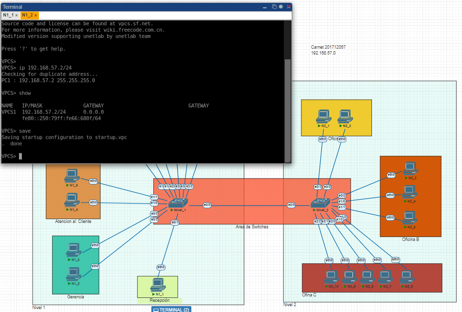
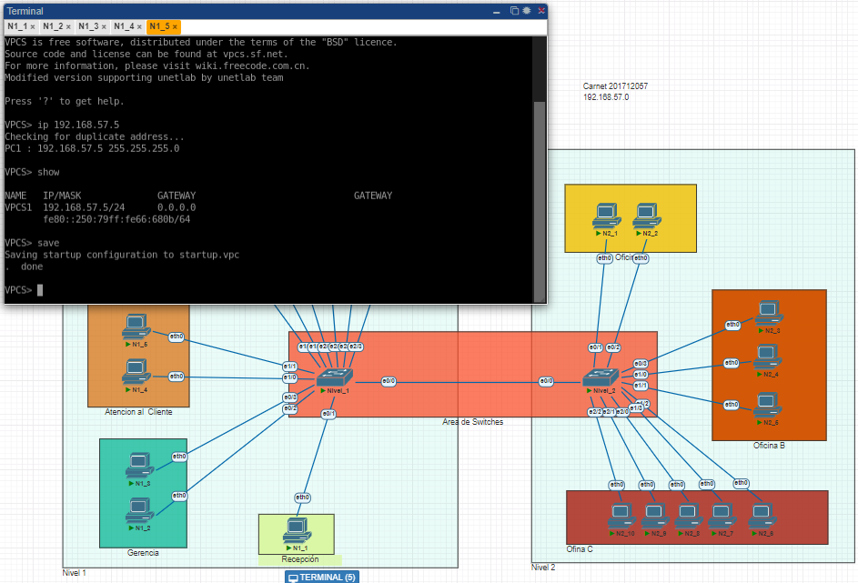
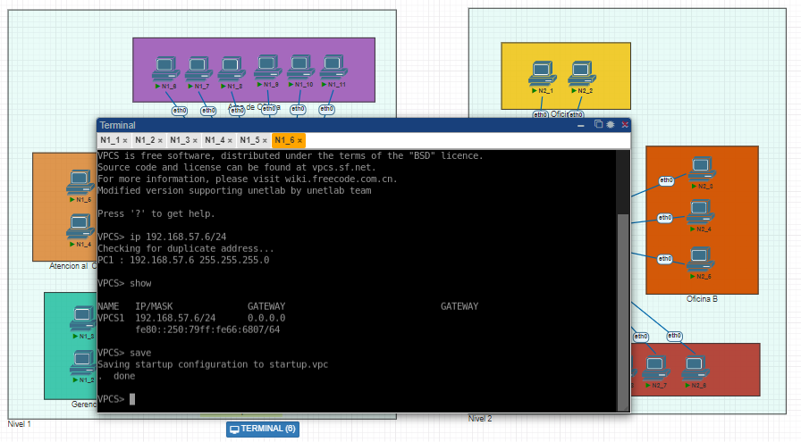
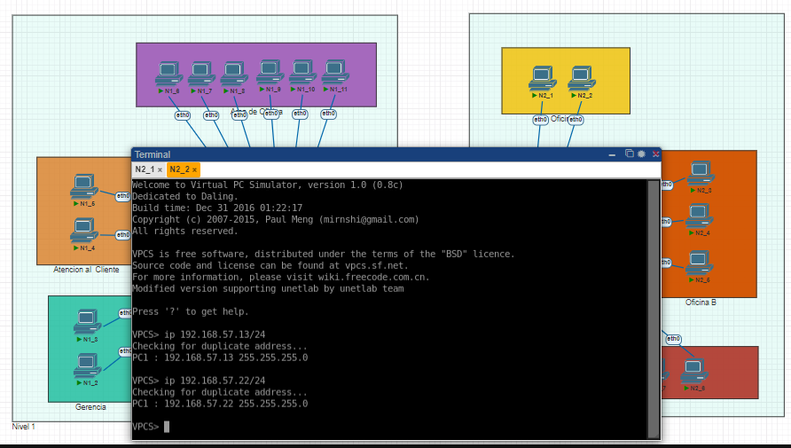
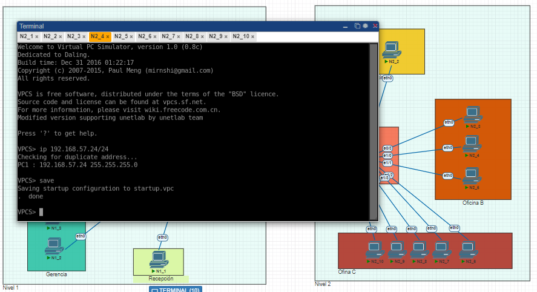
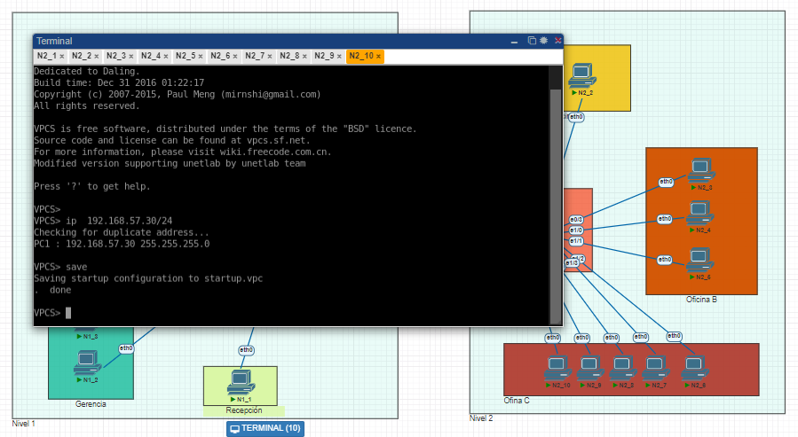
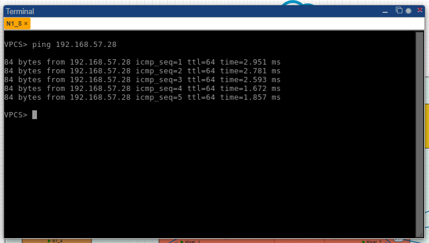
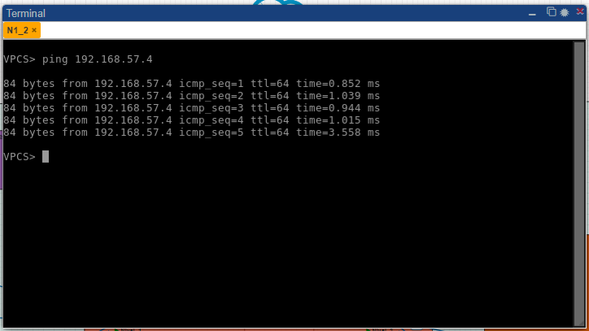
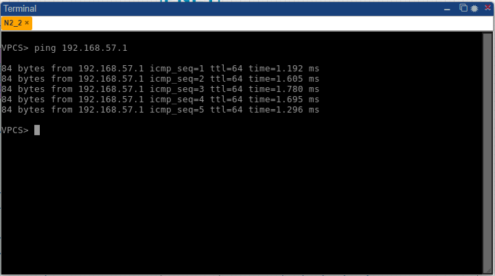
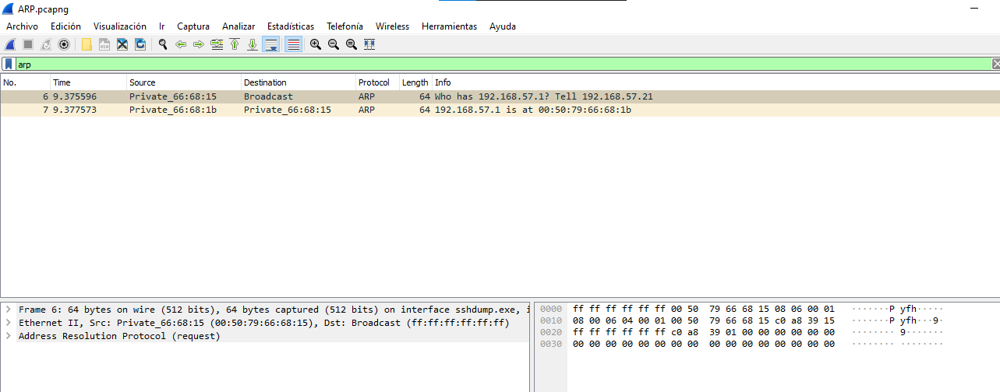

# Practica1_201712057

- Nombre: Vernik Carlos Alexander Yaxon Ortiz
- Carnet: 201712057

Para la creacion de la practica 1 se utilizo el id de red utilizando los ultimos dos numeros del carnet 192.168.57.0 empezando desde la 192.168.57.1 hasta la 192.168.57.30 ya que se dividio en segmentos para el nivel uno se utilizaron las ip de .57.1 hasta la .57.11 y para las maquinas en el nivel dos se utilizaron las ip de .57.21 hasta la .57.30

## Configuracion de VPCs por area

### Configuracion de VPC area de Recepcion

### Configuracion de VPC area de Gerencia

### Configuracion de VPC area de Atencion al Cliente

### Configuracion de VPC area de Oficina Nivel 1

### Configuracion de VPC area de Oficina A Nivel 2

### Configuracion de VPC area de Oficina B Nivel 2

### Configuracion de VPC area de Oficina C Nivel 2

## Pings
Para los pings entre las diferentes areas se realizaron los siguientes:

### Area Oficina Nivel 1 - Oficina C Nivel 2

### Gerencia - Atencion al Cliente

### Oficina A Nivel 2 - Recepcion Nivel 1

## Protocolo ARP

El protocolo ARP nos sirve para preguntar y encontrar la direccion a la cual queremos hacer un request en este caso un ping de una maquina a otra.

