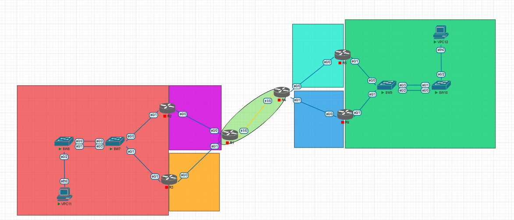

# Proyecto1_201712057

- Nombre: Vernik Carlos Alexander Yaxon Ortiz
- Carnet: 201712057

## Resumen de direcciones IP 

### Tabla de IPs

| Dispositivo   | Interfaz | IP | Mascara |
|----------|-----|----:|
| R1    |  s1/0  | 10.0.0.1  | 255.255.255.252 |
| R1    |  e0/0  | 172.168.1.2  | 255.255.255.248 |
| R1    |  e0/1  | 172.168.2.2  | 255.255.255.248 |
| R2    |  e0/0  | 172.168.1.1  | 255.255.255.248 |
| R2    |  e0/1  | 172.168.0.2 | 255.255.255.0 |
| R3    |  e0/0  | 172.168.2.1  | 255.255.255.248 |
| R3    |  e0/1  | 172.168.0.3 | 255.255.255.0 |
| R2-R3  |  virtual  | 172.168.0.1  | 255.255.255.0 |
| VPC11  |  eth0  | 172.168.0.4  | 255.255.255.0 |
| R4    |  s1/0  | 10.0.0.2  | 255.255.255.252 |
| R4    |  e0/0  | 172.178.1.1  | 255.255.255.248 |
| R4    |  e0/1  | 172.178.2.1  | 255.255.255.248 |
| R5    |  e0/0  | 172.178.1.2  | 255.255.255.248 |
| R5    |  e0/1  | 172.178.0.2 | 255.255.255.0 |
| R6    |  e0/0  | 172.178.2.2  | 255.255.255.248 |
| R6    |  e0/1  | 172.178.0.3 | 255.255.255.0 |
| R5-R6  |  virtual  | 172.178.0.1  | 255.255.255.0 |
| VPC12  |  eth0  | 172.178.0.4  | 255.255.255.0 |

### IPs Vpcs
Para la asignacion de IPs para las Vpc que se utilizaron,  172.168.0.4 para la VPC11 y para la VPC12 se utilizo 172.178.0.4

## Implementacion de la Topologia

### Topologia




### Configuracion Router R1

Empezamos configurando las interfaces y asignandoles ip.

```
configure terminal
interface s1/0 
ip address 10.0.0.1 255.255.255.252
no shutdown
```

Configuramos la siguiente interfaz

```
configure terminal
interface e0/0 
ip address 172.168.1.2 255.255.255.248
no shutdown
```

Configuramos la ultima interfaz

```
configure terminal
interface e0/1 
ip address 172.168.2.2 255.255.255.248
no shutdown
```

Despues debemos configurar todas las rutas hacia la derecha e izquierda con la siguiente configuracion

```
configure terminal
ip route 172.178.1.0 255.255.255.248 10.0.0.2
```
repetir este comando para todas las secciones o rutas que queramos agregar

### Configuracion Router R2

Empezamos configurando las interfaces y asignandoles ip.

```
configure terminal
interface   e0/0 
ip address 172.168.1.1 255.255.255.248
no shutdown
```

Configuramos la siguiente interfaz

```
configure terminal
interface e0/1 
ip address 172.168.0.2 255.255.255.0
no shutdown
```

Despues debemos configurar todas las rutas hacia la derecha e izquierda con la siguiente configuracion

```
configure terminal
ip route 10.0.0.0 255.255.255.252 172.168.1.2
```
repetir este comando para todas las secciones o rutas que queramos agregar

### Configuracion Router R5

Empezamos configurando las interfaces y asignandoles ip.

```
configure terminal
interface   e0/0 
ip address 172.178.1.2 255.255.255.248
no shutdown
```

Configuramos la siguiente interfaz

```
configure terminal
interface e0/1 
ip address 172.178.0.2 255.255.255.0
no shutdown
```

Despues debemos configurar todas las rutas hacia la izquierda con la siguiente configuracion

```
configure terminal
ip route 10.0.0.0 255.255.255.252 172.178.1.1
```
repetir este comando para todas las secciones o rutas que queramos agregar

### Configuracion Switch SW7

Para la configuracion del sw7 creamos el port chanel.

```
configure terminal
interface range f0/3-4
channel-group 1 mode desirable
no shutdown
```

### Configuracion VPC11

Configurando la VPC11.

```
ip 172.168.0.4 255.255.255.0
save
```

## Creacion de Rutas Estaticas 

## Creacion de PortChannel 


### Configuracion PAGP

Para la configuracion de PAGP en sw7 creamos el port chanel.

```
configure terminal
interface range e0/2-3
channel-group 1 mode desirable
no shutdown
```

Para la configuracion de PAGP en sw8 

```
configure terminal
interface range e0/0-1
channel-group 1 mode auto
no shutdown
```

### Configuracion LACP
Para la configuracion de LACP en sw9 creamos el modo activo.

```
configure terminal
interface range e0/2-3
channel-group 2 mode active
no shutdown
```

Para la configuracion de LACP en sw10 y configuramos el modo pasivo

```
configure terminal
interface range e0/0-1
channel-group 2 mode passive
no shutdown
```

### Configuracion IP Virtual HSRP

Para configurar la IP Virtual debemos ejecutar los siguietnes comandos, este se debe hacer en una router.

```
configure terminal
standby version 2
standby 21 ip 172.168.0.1
standby 21 priority 109
standby 21 preempt
do write
```

Para el segundo router debemos ejecutar los siguientes comandos

```
configure terminal
standby version 2
standby 21 ip 172.168.0.1
do write
```

### Configuracion IP Virtual GLBP

Para configurar la IP Virtual debemos ejecutar los siguietnes comandos, este se debe hacer en una router.

```
configure terminal
glbp 7 ip 172.178.0.1
glbp 7 preempt
glbp 7 priority 150
glbp 7 load-balancing round-robin
do write
```

Para el segundo router debemos ejecutar los siguientes comandos.

```
glbp 7 ip 172.178.0.1
glbp 7 load-balancing round-robin
do write
```
## Comandos Para la Verificacion 

Verificacion de configuracion de PortChannel.

```
show etherchannel summary
show pagp neighbor
show lacp neighbor
```

Verificar la configuracion de las IP y Rutas creadas

```
show ip route
show running-config | section ip route
```

Verificar la configuracion de HSRP

```
show standby
show standby brief
```

Verificar la configuracion GLBP

```
show glbp brief
```