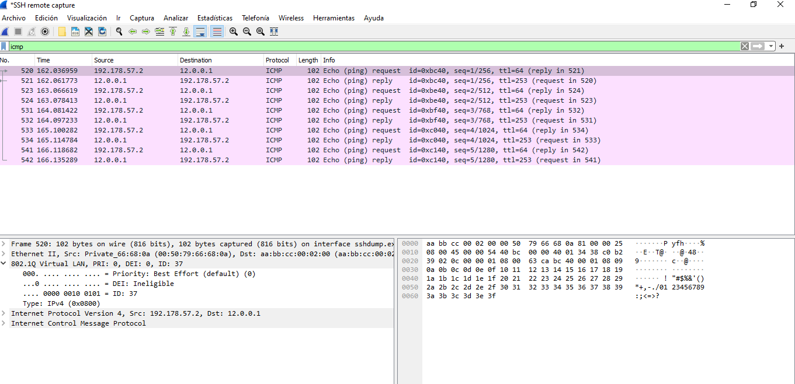

# Proyecto2_201712057

- Nombre: Vernik Carlos Alexander Yaxon Ortiz
- Carnet: 201712057

## Resumen de direcciones IP y VLAN

Para la creacion del Proyecto 2 se utilizaron las siguientes IDs para identificar a las Vlans de la topologia:
#### Central
Por la cantidad de equipos que se pueden conectar se elige la mascara de subred


#### Jutiapa


#### Core


#### Routers J1 y J2


#### Routers C1 y C2


## Implementacion de la Topologia

### Topologia Centro


### Topologia Cores


### Topologia Jutiapa


### Topologia Completa


## Comandos Utilizados

Para configuracion de los routers.

```
interface Ethernet 0/0.<numero de vlan>
encapsulation dot1q <numero de vlan>

interface Ethernet 0/0.10
encapsulation dot1q 10

enable
configure terminal
hostname R1
interface Ethernet 0/0
no shutdown
interface Ethernet 0/0.10
encapsulation dot1q 10
ip address 192.168.1.1 255.255.255.0
interface Ethernet 0/0.20
encapsulation dot1q 20
ip address 192.168.2.1 255.255.255.0
do write
```

Para el swtich de capa 3, se puede configurar el ip 

```
enable
configure terminal
interface e0/2
no switchport
ip address 192.167.57.4 255.255.255.0
no shutdown
do write
```

Y para la red interna podemos utilizar las siguientes comandos

```
enable
configure terminal
hostname ESW
vlan 17
name GERENCIA
vlan 27
name IT
interface e0/0
switchport trunk encapsulation dot1q
switchport mode trunk
interface vlan 17
ip address 192.168.57.1 255.255.255.0
no shutdown
interface vlan 27
ip address 192.168.57.1 255.255.255.0
no shutdown
exit
ip routing
do write
```

Para configuracion de las Vlans.
```
configure terminal
vlan 17
name RRHHH
vlan 27
name CONTABILIDAD
end
```

Configurar switches server y cliente

```
configure terminal
interface range Fa0/1-2
switchport trunk encapsulation dot1q
switchport mode trunk
```
Cliente

```
configure terminal
interface Fa0/1
switchport trunk encapsulation dot1q
switchport mode trunk
```

## Capturas WireShark

Captura Vlan

