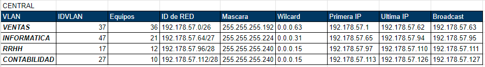
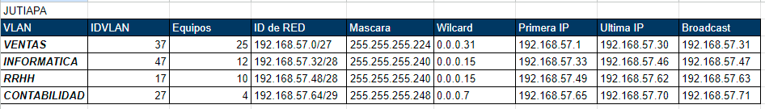
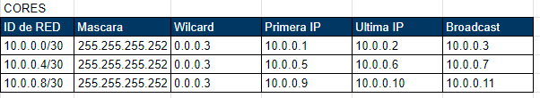
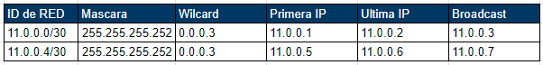
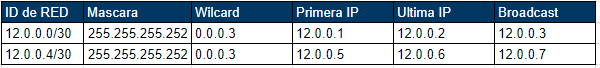
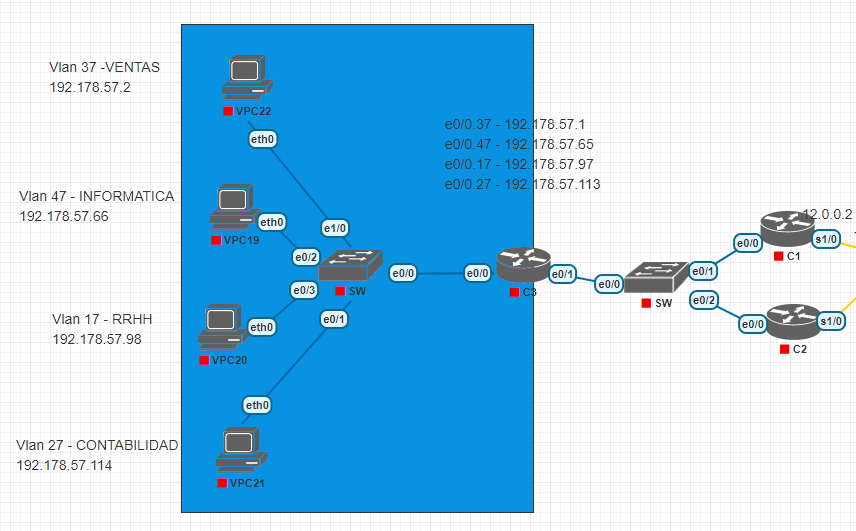
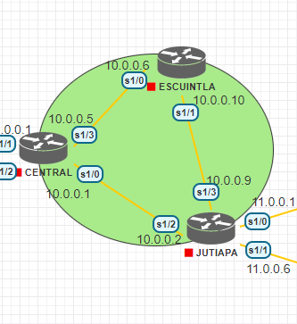
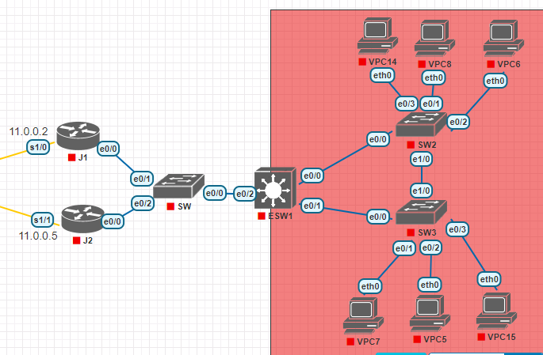
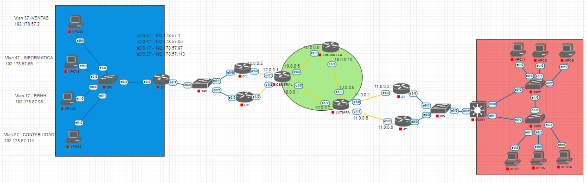

# Proyecto2_201712057

- Nombre: Vernik Carlos Alexander Yaxon Ortiz
- Carnet: 201712057

## Resumen de direcciones IP y VLAN

Para la creacion del Proyecto 2 se utilizaron las siguientes IDs para identificar a las Vlans de la topologia:
#### Central
Por la cantidad de equipos que se pueden conectar se elige la mascara de subred



#### Jutiapa


#### Core


#### Routers J1 y J2


#### Routers C1 y C2



## Implementacion de la Topologia

### Topologia Centro



### Topologia Cores



### Topologia Jutiapa



### Topologia Completa



### Configuracion de VTP para Servidor

Debemos asignar el modo troncal a las interfaces necesarias.

```
configure terminal
interface range e0/1-2
switchport trunk encapsulation dot1q
switchport mode trunk
```

Luego debemos crear las Vlan con los siguientes comandos podremos crear todas las que necesitemos en este caso creamos 4

```
configure terminal
vlan 17
name PRIMERA
vlan 27
name SEGUNDA
end
```

Procegimos con la configuracion del server vtp simpre recordando escribir el comando "do write" para guardar nuestras configuraciones realizadas

```
configure terminal
vtp version 2
vtp mode server
vtp domain dominio
vtp password contrasena
do write
```

### Configuracion de VTP para Cliente

Procedemos a configurar las interfaces en modo troncal para el cliente.
```
configure terminal
interface e0/1
switchport trunk encapsulation dot1q
switchport mode trunk
```

Configuramos el modo cliente en el switch

```
configure terminal
vtp mode client
vtp domain dominio
vtp password contrasena
do write
```

Y por ultimo asignamos el modo de acceso a las Vlans que necesitemos.

```
configure terminal
interface e0/2
switchport mode access
switchport access vlan 17
interface e0/3
switchport mode access
switchport access vlan 27
do write
```

### Configuracion de Modo Transparente

Y por ultimo configuramos el modo transparente para el switch en el proyecto

```
configure terminal
vtp mode transparent
vtp domain dominio
vtp password contrasena
do write
```

## Pings entre Hosts

### Ping de Server RRHH hacia RRHH_1


### Ping de Server Planeacion hacia Planeacion_1


